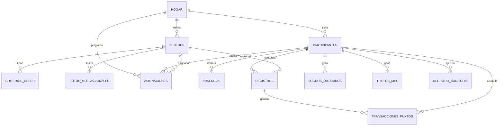

# Modelo de Datos — Sistema de Deberes de la Casa

> Documento de referencia para el desarrollo. Define todas las tablas de la base de datos (Postgres / Supabase), sus columnas, tipos, llaves y relaciones, más las notas de diseño que las conectan con el reglamento.
>
> **Principio de escalabilidad:** todo cuelga del objeto `hogar`. Por ahora existe un solo hogar (sin login multi-hogar), pero modelarlo así permite pasar a multihogar después solo añadiendo autenticación y filtrando por `hogar_id`, sin reescribir el esquema.

---

## Diagrama entidad-relación (Mermaid)

---

## Tablas

### `hogar`
La configuración global del hogar y la raíz de todo.

| Columna | Tipo | Notas |
|---------|------|-------|
| id | uuid | PK |
| nombre | text | |
| zona_horaria | text | default `'America/Caracas'` |
| hora_cierre_dia | time | default `'03:00'` — el día cuenta hasta esta hora |
| bono_ayuda | numeric | puntos extra al cubrir a otro (default 5) |
| penalizacion_fallo | numeric | se resta al fallar sin razón (default 15) |
| penalizacion_colectiva | numeric | se resta a los tres si un obligatorio no lo hace nadie (default 10) |
| creado_en | timestamptz | default now() |

### `participantes`
Las personas que participan en los deberes.

| Columna | Tipo | Notas |
|---------|------|-------|
| id | uuid | PK |
| hogar_id | uuid | FK → hogar |
| auth_user_id | uuid | FK → auth.users, nullable (para login futuro) |
| nombre | text | |
| foto_url | text | nullable |
| es_admin | boolean | default false |
| activo | boolean | default true — permite sacar a alguien de la rotación sin borrar su historial |
| orden_rotacion | int | posición en el círculo de rotación |
| creado_en | timestamptz | |

### `deberes`
Los deberes, totalmente configurables por el admin. Dos ejes independientes: `tipo_asignacion` (cómo se asigna) y `es_obligatorio` (qué tan crítico es).

| Columna | Tipo | Notas |
|---------|------|-------|
| id | uuid | PK |
| hogar_id | uuid | FK → hogar |
| nombre | text | |
| tipo_asignacion | text | `'rotativo'` \| `'reclamable'` |
| es_obligatorio | boolean | obligatorio: hay penalización si nadie lo hace |
| es_personal | boolean | cada quien hace el suyo (ej. cuarto, clóset) vs comunitario |
| puntos | numeric | soporta decimales (ej. 2.5) |
| cadencia | text | `'diaria'` \| `'dia_por_medio'` \| `'semanal'` \| `'mensual'`. Para reclamables indica el período de reinicio del cupo (`'semanal'` o `'mensual'`) |
| dias_disponibles | text[] / jsonb | días de la semana en que el deber se muestra. "Toda la semana" = los 7 días; "fin de semana" = viernes, sábado y domingo |
| max_reclamos | int | nullable — número total de veces que el extra puede reclamarse por período (total del hogar, no por persona). Null = sin límite. Solo aplica a reclamables |
| requiere_foto | boolean | los obligatorios = false (check); reclamables/opcionales = true |
| activo | boolean | default true — retirar sin borrar historial |
| creado_en | timestamptz | |

### `criterios_deber`
La lista de sub-tareas que definen "cumplido" para cada deber.

| Columna | Tipo | Notas |
|---------|------|-------|
| id | uuid | PK |
| deber_id | uuid | FK → deberes |
| descripcion | text | ej. "Servirle comida y agua en la mañana" |
| orden | int | para mostrarlas ordenadas |

### `asignaciones`
El plan semanal de los deberes rotativos: quién hace qué rotativo cada día. Lo genera el motor de rotación y lo edita el admin.

| Columna | Tipo | Notas |
|---------|------|-------|
| id | uuid | PK |
| hogar_id | uuid | FK → hogar |
| deber_id | uuid | FK → deberes |
| participante_id | uuid | FK → participantes |
| fecha | date | |
| creado_en | timestamptz | |

### `ausencias`
Ausencias declaradas (viajes, días fuera). El plan y el ranking de porcentaje las respetan.

| Columna | Tipo | Notas |
|---------|------|-------|
| id | uuid | PK |
| participante_id | uuid | FK → participantes |
| fecha_inicio | date | |
| fecha_fin | date | |
| motivo | text | nullable |
| aprobada_por | uuid | FK → participantes (el admin), nullable |
| creado_en | timestamptz | |

### `registros`
**El historial permanente.** Cada vez que alguien marca un deber como hecho.

| Columna | Tipo | Notas |
|---------|------|-------|
| id | uuid | PK |
| hogar_id | uuid | FK → hogar |
| deber_id | uuid | FK → deberes |
| participante_id | uuid | FK → participantes (quién lo hizo) |
| fecha | date | día que cuenta (respeta el cierre de las 3 AM) |
| estado | text | `'cumplido_propio'` \| `'cubrio_a_otro'` \| `'reclamado'` |
| cubierto_a | uuid | FK → participantes, nullable (a quién cubrió) |
| confirmado | boolean | default false — para coberturas, lo confirma el ayudado |
| confirmado_por | uuid | FK → participantes, nullable |
| foto_url | text | nullable — prueba para reclamables/opcionales y coberturas |
| nota | text | nullable — justificación |
| creado_en | timestamptz | |

### `transacciones_puntos`
El libro mayor de puntos. Los puntos no se guardan sueltos: cada suma/resta es una fila. Los rankings se calculan sumando estas filas.

| Columna | Tipo | Notas |
|---------|------|-------|
| id | uuid | PK |
| hogar_id | uuid | FK → hogar |
| participante_id | uuid | FK → participantes |
| registro_id | uuid | FK → registros, nullable (qué cumplimiento lo generó; null si es ajuste de admin) |
| cantidad | numeric | negativo para penalizaciones, soporta decimales |
| tipo | text | ver "Matriz de puntos" abajo |
| fecha | date | |
| creado_en | timestamptz | |

### `logros_obtenidos`
Las medallas coleccionables que un participante desbloquea. Se quedan para siempre.

| Columna | Tipo | Notas |
|---------|------|-------|
| id | uuid | PK |
| participante_id | uuid | FK → participantes |
| logro_clave | text | referencia al catálogo fijo de logros (en código) |
| nivel | text | nullable: `'bronce'` \| `'plata'` \| `'oro'` |
| fecha_obtenido | date | |
| creado_en | timestamptz | |

### `titulos_mes`
Los ganadores de los cuatro rankings cada mes.

| Columna | Tipo | Notas |
|---------|------|-------|
| id | uuid | PK |
| participante_id | uuid | FK → participantes |
| ranking | text | `'general'` \| `'confiable'` \| `'solidario'` \| `'responsable'` |
| mes | text | ej. `'2026-06'` |
| creado_en | timestamptz | |

### `registro_auditoria`
Cada acción del admin, visible para los tres (transparencia).

| Columna | Tipo | Notas |
|---------|------|-------|
| id | uuid | PK |
| hogar_id | uuid | FK → hogar |
| admin_id | uuid | FK → participantes |
| accion | text | ej. `'anular_puntos'`, `'editar_plan'`, `'ajuste_puntos'` |
| detalle | jsonb | qué cambió exactamente |
| fecha | timestamptz | |

### `fotos_motivacionales`
Las fotos que se muestran en los recordatorios para motivar (Sofi, mamá sonriendo). **No son pruebas**, son motivación.

| Columna | Tipo | Notas |
|---------|------|-------|
| id | uuid | PK |
| hogar_id | uuid | FK → hogar |
| url | text | |
| contexto | text | ej. `'sofi'`, `'mama'` |
| deber_id | uuid | FK → deberes, nullable (si se ata a un deber específico) |
| creado_en | timestamptz | |

---

## Matriz de puntos (evento → cantidad → a qué ranking afecta)

El campo `transacciones_puntos.tipo` codifica cada evento. El motor traduce así:

| tipo | Cantidad | Rankings que afecta |
|------|----------|--------------------|
| `cumplimiento` | + puntos del deber (10 los obligatorios) | General, Confiable |
| `bono_ayuda` | + puntos del deber + `bono_ayuda` | General, Solidario |
| `reclamable` | + puntos del deber | General, Responsable |
| `penalizacion` | − `penalizacion_fallo` | General, Confiable |
| `penalizacion_colectiva` | − `penalizacion_colectiva` (a los tres) | General |
| `ajuste_admin` | ± lo que ponga el admin | según corresponda |

Reglas clave del motor:
- El `bono_ayuda` solo se otorga si el participante ya cumplió su propio deber del día **y** el ayudado confirmó (`registros.confirmado = true`).
- Al reclamar un extra, el motor cuenta los `registros` con estado `'reclamado'` de ese deber dentro del período actual (semanal o mensual, según `cadencia`); solo permite el reclamo si ese conteo es menor que `max_reclamos`. El conteo es **total del hogar, no por participante**: varios participantes pueden reclamar el mismo extra en días distintos hasta agotar el cupo. Cuando se agota, el extra deja de poder reclamarse hasta que el período reinicie.
- El ranking **Confiable** (porcentaje) = deberes propios cumplidos ÷ deberes que le tocaban los días presentes. Las ausencias no entran en el denominador.
- Una ausencia válida no genera penalización ni puntos: simplemente el deber no aplica ese día.

---

## Notas de diseño

- **Catálogo de logros:** las definiciones de logros y títulos son **fijas** (van en código, el admin no las modifica). La tabla `logros_obtenidos` solo guarda las instancias ganadas.
- **Los puntos se derivan, no se duplican:** todo ranking se calcula sumando `transacciones_puntos`. Esto da el historial, la auditoría y permite que el admin corrija con filas de tipo `ajuste_admin` en vez de sobrescribir.
- **Motor de rotación genérico:** `asignaciones` soporta cualquier número de participantes y de deberes rotativos. La rotación se calcula como dos círculos que giran un paso por día (ver documento de la idea).
- **Seguridad (RLS):** un participante solo puede insertar `registros` y confirmar coberturas que le correspondan; solo el admin escribe en `transacciones_puntos` (tipo `ajuste_admin`), edita `asignaciones` y aprueba `ausencias`. Toda acción de admin se refleja en `registro_auditoria`.
- **Decisión pendiente para la fase de build:** cómo se autentican los tres participantes en un solo hogar (login real con `auth_user_id`, o selección simple de "quién soy"). El esquema ya deja `auth_user_id` listo para lo primero.
